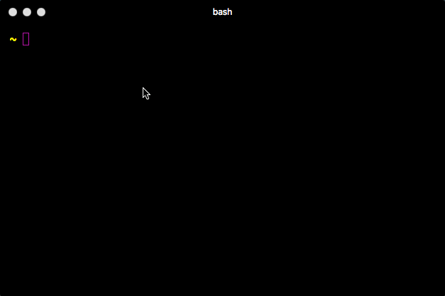

# esh - easy SSH

With **esh** you can interact with a remote machine without opening an interactive shell.

**esh** runs your command on remote machine by reading `args` and prints the `stdout` and `stderr`

#### usage: esh [\<flags\>] \<command\> [\<args\> ...]



## Flags:
### -h, --help
Show context-sensitive help (also try --help-long and --help-man).

## Commands:

### help \<command\>
Shows help for the specified command.

### add --name=NAME --server=127.0.0.1 --user=USER [\<flags\>]
Adds a SSH session to config.

### use \<name\>
Use a specific ssh session.

### list-all
List all saved SSH sessions.

### logout
Logout from current session.

### remove \<name\>
Remove a given session with name.

### get \<getpath\>
Get some file or folder.

### put \<putpath\>
Put some file or folder.


# build()
### With Docker
```
cd $PROJECT_ROOT/src
docker run -it --rm -v `pwd`:/go/src/esh -w /go/src/esh golang bash
# In docker shell now...
go get
env GOOS=darwin GOARCH=386 go build -o ../bin/esh -v *.go
```

# future.print()
### TODOs & Features:
1. Fix any bugs, there are a few, ex. we get crashes if we try to upload/download files that don't exist (https://github.com/gurinderhans/esh/issues/1)
2. Optimize download and upload code to transfer files faster.
  - Download is waaaay slower than upload, culprit seems to be the `sftp` library being used. If we are to remove it, maybe the way to download a file can be to open a reverse SSH connection and then do a upload from server to computer?? Is this possible?
3. Create a maybe seperate background daemon program that keeps ssh connections alive and another main program that will use the 'open' ssh connections there to contact server/device just to speed the commands speed. Really unsure if this will add speed ???
4. This one would be amazing. Have a way to do like `esh vim /some/remote/path/to/file` and it would open a `vim` buffer locally where saves would automatically save the file on the server, and behind the scenes, we'll be doing fetching and putting of the file between our device and server
5. Also open to other directions and suggestions
